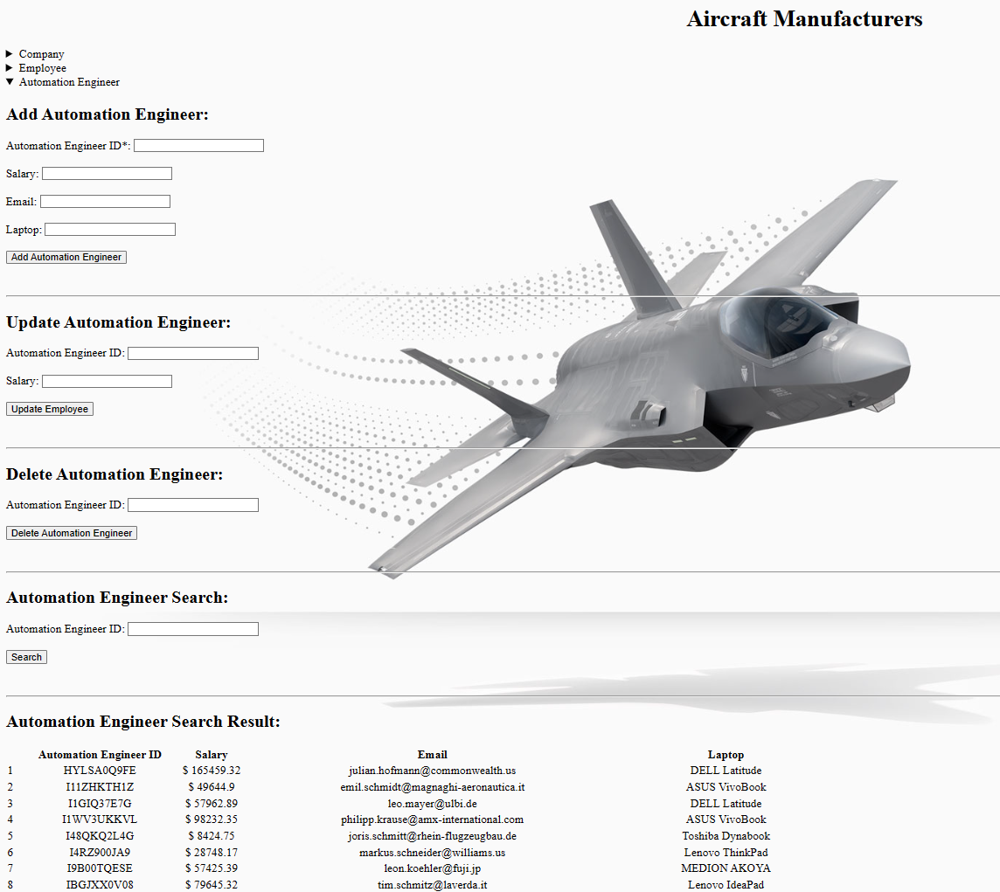

# ✈️ Aircraft Manufacturing Database System – Database Systems Course Project

This project simulates a relational database system for managing companies that design, produce, and maintain aircraft. It includes entity modeling, logical design, SQL-based implementation, and a web frontend built with Java and PHP. The focus is on **real-world data modeling**, **SQL automation**, and **web integration**.

---

## 📚 Course Context

**Course**: Database Systems  
**Milestones**:
1. Requirements Analysis & Conceptual Design  
2. Logical Design & Relational Mapping  
3. SQL Implementation (PostgreSQL + Oracle)  
4. Java + PHP Integration & Web GUI  

---

## 🧱 Project Structure

### 📐 ER Design (Milestone 1)

The system models the following real-world entities:

- `Unternehmen` (Company)
- `Mitarbeiter` (Employee)  
  - Specializations: `Automatisierungstechniker` (Automation Engineer), `Konstrukteur` (Design Engineer)
- `Projekt` (Project)
- `Flugzeug` (Aircraft)
- `Prüfanlage` (Test Facility)

Key relationships include:
- Employees work for companies
- Projects involve employees and produce aircraft
- Aircraft are maintained through test facilities and automation engineers

<figure>
  
  <figcaption><b>Figure:</b> Entity Relationship Diagram</figcaption>
</figure>

---

### 🔢 Logical Design (Milestone 2)

All entities were mapped to relational tables with:
- Primary Keys (PK)
- Foreign Keys (FK)
- Cardinality and entity relationships preserved

See full logical mapping [here](./docs/relational_design.txt)

---

## 💾 Milestone 3: SQL + Java + PHP Implementation

### 📁 SQL & Data

- Tables and constraints written in SQL
- Data imported from real sources:
  - Aircraft manufacturers: [aircraft-database.com](https://aircraft-database.com)
  - Aircraft models: [back4app.com](https://www.back4app.com)
- Procedures, triggers, and views created to automate:
  - ID generation (`DBMS_RANDOM.STRING`)
  - Email generation
  - License numbers and dates

> **Views** were added to easily retrieve combined employee/project data

---

### ☕ Java Module (Backend)

Located in `/java`:
- CSV-based data generation (`.csv` files → DB)
- Randomized insert logic (e.g. names, birthdates, salaries)
- Employee specialization mapping (`AutomationEngineer`, `Constructor`)
- Libraries used:
  - JDBC
  - `randomHelper.java` for reproducible fake data

---

### 🌐 PHP Web Interface

Located in `/php`:
- Responsive interface with `
` collapsible sections per table
- User can:
  - **Add**, **Update**, **Delete**, or **Search** entries
  - Easily switch companies for employees
  - Update salary/laptop for automation engineers

<figure>
  
  <figcaption><b>Figure:</b> Screenshot of the collapsible web frontend</figcaption>
</figure>

---

## 🔧 Technologies Used

| Layer      | Tech Stack                         |
|------------|------------------------------------|
| Database   | Oracle SQL + PostgreSQL            |
| Backend    | Java + CSV + JDBC                  |
| Frontend   | HTML, CSS, PHP                     |
| Tools      | DBVisualizer, SQL Developer, IntelliJ |

---

## 🧪 Sample Features

- 💼 View aircraft manufacturers and employees by company
- ⚙️ Track production and maintenance projects
- 🔎 Filter automation engineers by ID, salary, or laptop
- 📅 Randomized project deadlines and equipment codes
<figure>
  
  <figcaption><b>Figure:</b> Web interface for managing Automation Engineers</figcaption>
</figure>

---

## 🧠 Learning Outcomes

- Translate real-world domain into relational structure
- Work with multi-table JOINs, views, and constraints
- Use procedural SQL for automation
- Build a working full-stack app (SQL + Java + PHP)
- Understand ER → Logical → Physical DB development

---

## 📄 License

This project is developed for educational purposes in the **Database Systems** course. No commercial use intended.

---
